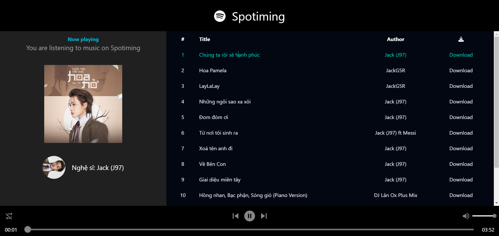

# Spotify Clone - React + Tailwind CSS

Đây là một dự án clone đơn giản của Spotify, được xây dựng bằng **React** và **Tailwind CSS**. Dự án này nhằm mục đích học tập và thực hành các kỹ năng front-end, bao gồm việc sử dụng React để xây dựng giao diện người dùng và Tailwind CSS để tạo kiểu nhanh chóng và hiệu quả.

## Link Deploy

Bạn có thể truy cập ứng dụng đã được deploy tại đây:  
[jolly-kleicha-2fcef9.netlify.app](https://jolly-kleicha-2fcef9.netlify.app/)

## Công nghệ sử dụng

- **React**: Thư viện JavaScript để xây dựng giao diện người dùng.
- **Tailwind CSS**: Framework CSS utility-first giúp tạo kiểu nhanh chóng và dễ dàng.
- **React Router**: Để quản lý routing trong ứng dụng.
- **Axios**: Để thực hiện các yêu cầu HTTP đến API.
- **Netlify**: Dịch vụ deploy và hosting ứng dụng web.